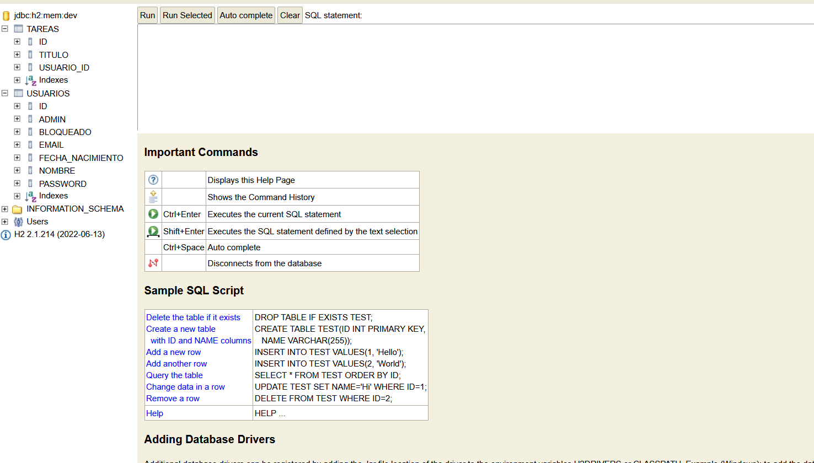

# Extra-work

## GitHub repository

Repository link:

```text
https://github.com/jamesbobbrown/p2-todolist-app
```

## Trello board

Trello board link:

```text
https://trello.com/b/VsorUKgo/p2-to-do-list-app
```

## Docker image

Docker image link:

```text
https://hub.docker.com/r/jamesbobbrown/p2-todolistapp
```

Final Docker image tag:

```text
jamesbobbrown/p2-todolistapp:extra-work
```

---

# Extra work developed

The extra work developed for the TodoList application is the implementation of an administrator role with user management functionality.

The application now includes an administrator user who can access the registered users list and manage the access of the users of the application.

The extra functionality includes:

* Creating an administrator user from the registration form.
* Allowing only one administrator user in the application.
* Redirecting the administrator to the registered users page after login.
* Protecting the registered users page so that only an administrator can access it.
* Protecting the user description page so that only an administrator can access it.
* Showing the list of registered users to the administrator.
* Showing the description of a selected user.
* Allowing the administrator to block a user.
* Allowing the administrator to unblock a user.
* Preventing a blocked user from logging into the application.
* Showing the message `Usuario bloqueado` when a blocked user tries to log in.

This extra work improves the original TodoList application because it adds basic administration and user access control.

---

# Methodology followed

The development was organized using GitHub, Trello and Git branches.

The main branch used for integration was:

```text
develop
```

The workflow followed was:

1. Create a Trello card for the extra work.
2. Create a GitHub issue linked to the Trello card.
3. Create a branch from `develop`.
4. Implement or document the functionality.
5. Run the tests with Maven.
6. Create a pull request into `develop`.
7. Check that the tests pass.
8. Merge the pull request.
9. Move the Trello card to Done.
10. Merge `develop` into `main` for the final version.

This methodology was used to show continuous development and to keep the extra work organized.

---

# Implemented classes and methods

## `Usuario`

Path:

```text
src/main/java/todolist/model/Usuario.java
```

The `Usuario` entity was modified to support administrator users and blocked users.

Implemented or modified attributes:

| Attribute   | Type      | Explanation                                    |
| ----------- | --------- | ---------------------------------------------- |
| `admin`     | `boolean` | Indicates whether the user is an administrator |
| `bloqueado` | `boolean` | Indicates whether the user is blocked          |

Implemented or modified methods:

| Method                            | Explanation                                  |
| --------------------------------- | -------------------------------------------- |
| `isAdmin()`                       | Returns whether the user is an administrator |
| `setAdmin(boolean admin)`         | Sets whether the user is an administrator    |
| `isBloqueado()`                   | Returns whether the user is blocked          |
| `setBloqueado(boolean bloqueado)` | Sets whether the user is blocked             |

---

## `UsuarioData`

Path:

```text
src/main/java/todolist/dto/UsuarioData.java
```

The `UsuarioData` DTO was modified so that the controller and templates can use the administrator and blocked-user information without directly using the entity.

Implemented or modified attributes:

| Attribute   | Type      | Explanation                                    |
| ----------- | --------- | ---------------------------------------------- |
| `admin`     | `boolean` | Indicates whether the user is an administrator |
| `bloqueado` | `boolean` | Indicates whether the user is blocked          |

Implemented or modified methods:

| Method                            | Explanation                                  |
| --------------------------------- | -------------------------------------------- |
| `isAdmin()`                       | Returns whether the user is an administrator |
| `setAdmin(boolean admin)`         | Sets the administrator value                 |
| `isBloqueado()`                   | Returns whether the user is blocked          |
| `setBloqueado(boolean bloqueado)` | Sets the blocked value                       |

---

## `RegistroData`

Path:

```text
src/main/java/todolist/dto/RegistroData.java
```

The registration DTO was modified so the registration form can send whether the new user should be an administrator.

Implemented or modified attribute:

| Attribute | Type      | Explanation                                                      |
| --------- | --------- | ---------------------------------------------------------------- |
| `admin`   | `boolean` | Indicates whether the user should be registered as administrator |

Implemented or modified methods:

| Method                    | Explanation                                                  |
| ------------------------- | ------------------------------------------------------------ |
| `isAdmin()`               | Returns whether the registration form selected administrator |
| `setAdmin(boolean admin)` | Sets the administrator value from the form                   |

---

## `UsuarioService`

Path:

```text
src/main/java/todolist/service/UsuarioService.java
```

The `UsuarioService` class contains the business logic for login, administrator control, user listing and blocking users.

Implemented or modified methods:

| Method                                         | Explanation                                                                   |
| ---------------------------------------------- | ----------------------------------------------------------------------------- |
| `login(String eMail, String password)`         | Checks if the login is correct. It also checks if the user is blocked         |
| `registrar(UsuarioData usuario)`               | Registers a new user. It also controls the creation of the administrator user |
| `existeAdministrador()`                        | Checks if an administrator user already exists                                |
| `esAdministrador(Long usuarioId)`              | Checks if the selected user is an administrator                               |
| `usuarioEsAdministradorPorEmail(String email)` | Checks if a user is administrator using the email                             |
| `findAllUsuarios()`                            | Returns all registered users ordered by identifier                            |
| `findUsuarioDescripcionById(Long usuarioId)`   | Returns the data of one selected user                                         |
| `bloquearUsuario(Long usuarioId)`              | Blocks a user so that they cannot log in                                      |
| `desbloquearUsuario(Long usuarioId)`           | Unblocks a user so that they can log in again                                 |
| `usuarioBloqueado(Long usuarioId)`             | Checks if a user is currently blocked                                         |

The `LoginStatus` enum was also modified to include:

```text
USER_BLOCKED
```

This status is returned when a blocked user tries to log in.

---

## `LoginController`

Path:

```text
src/main/java/todolist/controller/LoginController.java
```

The `LoginController` was modified to manage administrator login, administrator registration and blocked-user login errors.

Implemented or modified methods:

| Method                                                                         | Endpoint         | Explanation                                                                                                                             |
| ------------------------------------------------------------------------------ | ---------------- | --------------------------------------------------------------------------------------------------------------------------------------- |
| `loginForm(Model model)`                                                       | `GET /login`     | Shows the login form                                                                                                                    |
| `loginSubmit(LoginData loginData, Model model, HttpSession session)`           | `POST /login`    | Logs the user in. If the user is administrator, redirects to `/registered`. If the user is blocked, shows the error `Usuario bloqueado` |
| `registroForm(Model model)`                                                    | `GET /registro`  | Shows the registration form and indicates whether an administrator already exists                                                       |
| `registroSubmit(RegistroData registroData, BindingResult result, Model model)` | `POST /registro` | Registers the user and allows administrator creation if there is no administrator yet                                                   |
| `logout(HttpSession session)`                                                  | `GET /logout`    | Logs the user out                                                                                                                       |

---

## `TareaController`

Path:

```text
src/main/java/todolist/controller/TareaController.java
```

The original task controller continues managing the task functionality of the application.

The extra work keeps the original task endpoints working for normal users while administrator users are redirected to the registered users page.

Original task methods kept in the application:

| Method                      | Endpoint                           | Explanation                            |
| --------------------------- | ---------------------------------- | -------------------------------------- |
| `listadoTareas(...)`        | `GET /usuarios/{id}/tareas`        | Shows the task list of the logged user |
| `formNuevaTarea(...)`       | `GET /usuarios/{id}/tareas/nueva`  | Shows the form to create a task        |
| `nuevaTarea(...)`           | `POST /usuarios/{id}/tareas/nueva` | Creates a new task                     |
| `formEditaTarea(...)`       | `GET /tareas/{id}/editar`          | Shows the form to edit a task          |
| `grabaTareaModificada(...)` | `POST /tareas/{id}/editar`         | Saves a modified task                  |
| `borrarTarea(...)`          | `DELETE /tareas/{id}`              | Deletes a task                         |

---

# Controllers and endpoints

## Login and registration endpoints

| Method | Endpoint    | Controller        | Explanation                                                   |
| ------ | ----------- | ----------------- | ------------------------------------------------------------- |
| `GET`  | `/login`    | `LoginController` | Shows the login page                                          |
| `POST` | `/login`    | `LoginController` | Processes login and checks if the user is blocked             |
| `GET`  | `/registro` | `LoginController` | Shows the registration page                                   |
| `POST` | `/registro` | `LoginController` | Registers a new user and optionally creates the administrator |
| `GET`  | `/logout`   | `LoginController` | Logs the user out                                             |

## Administrator endpoints

| Method | Endpoint                       | Explanation                                                                        |
| ------ | ------------------------------ | ---------------------------------------------------------------------------------- |
| `GET`  | `/registered`                  | Shows the list of registered users. Only the administrator can access it           |
| `GET`  | `/registered/{id}`             | Shows the description of one registered user. Only the administrator can access it |
| `POST` | `/registered/{id}/bloquear`    | Blocks the selected user                                                           |
| `POST` | `/registered/{id}/desbloquear` | Unblocks the selected user                                                         |

## Task endpoints

| Method   | Endpoint                      | Explanation                            |
| -------- | ----------------------------- | -------------------------------------- |
| `GET`    | `/usuarios/{id}/tareas`       | Shows the task list of the logged user |
| `GET`    | `/usuarios/{id}/tareas/nueva` | Shows the form to create a new task    |
| `POST`   | `/usuarios/{id}/tareas/nueva` | Creates a new task                     |
| `GET`    | `/tareas/{id}/editar`         | Shows the form to edit a task          |
| `POST`   | `/tareas/{id}/editar`         | Saves the modified task                |
| `DELETE` | `/tareas/{id}`                | Deletes a task                         |

---

# Thymeleaf templates included

| Template                  | Explanation                                                                        |
| ------------------------- | ---------------------------------------------------------------------------------- |
| `formLogin.html`          | Login page. It shows login errors, including the blocked-user message              |
| `formRegistro.html`       | Registration page. It allows creating an administrator if no administrator exists  |
| `listaUsuarios.html`      | Shows all registered users to the administrator and includes block/unblock actions |
| `descripcionUsuario.html` | Shows the details of a selected user                                               |
| `listaTareas.html`        | Shows the task list of the logged user                                             |
| `formNuevaTarea.html`     | Form used to create a new task                                                     |
| `formEditarTarea.html`    | Form used to edit an existing task                                                 |
| `fragments.html`          | Common page fragments, including the navigation bar                                |
| `about.html`              | Static About page of the application                                               |

---

# Tests implemented

The extra work includes service-layer and controller/web tests.

## Service tests

The service tests check the business logic related to users, administrators and blocking.

The tested functionality includes:

* Creating a normal user.
* Creating an administrator user.
* Preventing the creation of more than one administrator.
* Checking whether an administrator exists.
* Checking whether a user is administrator.
* Listing all registered users.
* Recovering the description of a selected user.
* Blocking a user.
* Unblocking a user.
* Checking whether a user is blocked.
* Preventing a blocked user from logging in.

## Controller and web tests

The controller tests check that the web endpoints work correctly.

The tested functionality includes:

* Showing the registered users list to the administrator.
* Showing the description page of a selected user to the administrator.
* Blocking a user from the registered users page.
* Unblocking a user from the registered users page.
* Returning an unauthorized response when a non-administrator tries to access administrator-only pages.
* Returning an unauthorized response when an anonymous user tries to access administrator-only pages.
* Showing the message `Usuario bloqueado` when a blocked user tries to log in.

---

# Database changes

The extra work modifies the `usuarios` table.

The following columns were added to the user model:

| Column      | Type      | Explanation                               |
| ----------- | --------- | ----------------------------------------- |
| `admin`     | `boolean` | Indicates if the user is an administrator |
| `bloqueado` | `boolean` | Indicates if the user is blocked          |

These fields are generated in the database from the `Usuario` entity.

## Database screenshot

The screenshot of the database structure should be added in the repository using the following path:

```text
docs/extra-work-database.png
```

The image should show the `usuarios` table with the columns:

```text
id
email
nombre
password
fecha_nacimiento
admin
bloqueado
```

Screenshot link:

```markdown

```

---

# Docker commands

## Run tests

```bash
mvn clean test
```

## Package application

```bash
mvn clean package
```

## Build Docker image

```bash
docker build -t jamesbobbrown/p2-todolistapp:extra-work .
```

## Push Docker image

```bash
docker push jamesbobbrown/p2-todolistapp:extra-work
```

## Pull Docker image

```bash
docker pull jamesbobbrown/p2-todolistapp:extra-work
```

## Run Docker image

```bash
docker run --rm -p 8081:8080 jamesbobbrown/p2-todolistapp:extra-work
```

---

# Final result

The extra work adds an administrator role and user blocking functionality to the TodoList application.

This improves the application because it allows the administrator to manage user access.

The final version includes:

* Source code.
* Tests.
* Documentation in `Extra-work.md`.
* GitHub repository link.
* Trello board link.
* Docker image link.
* Database screenshot.
* Continuous development using the `develop` branch.
